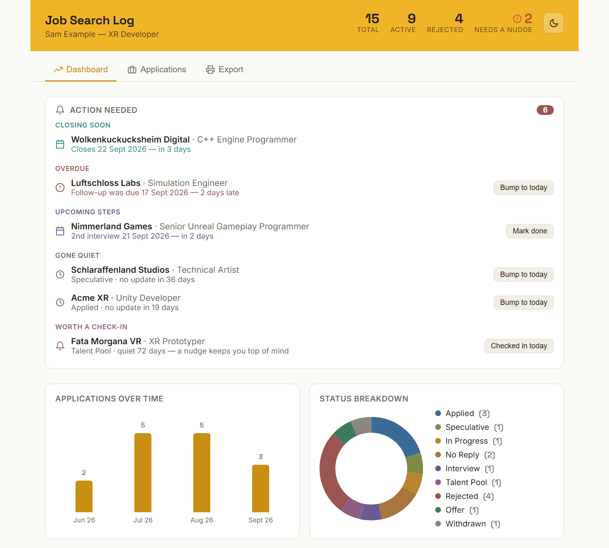
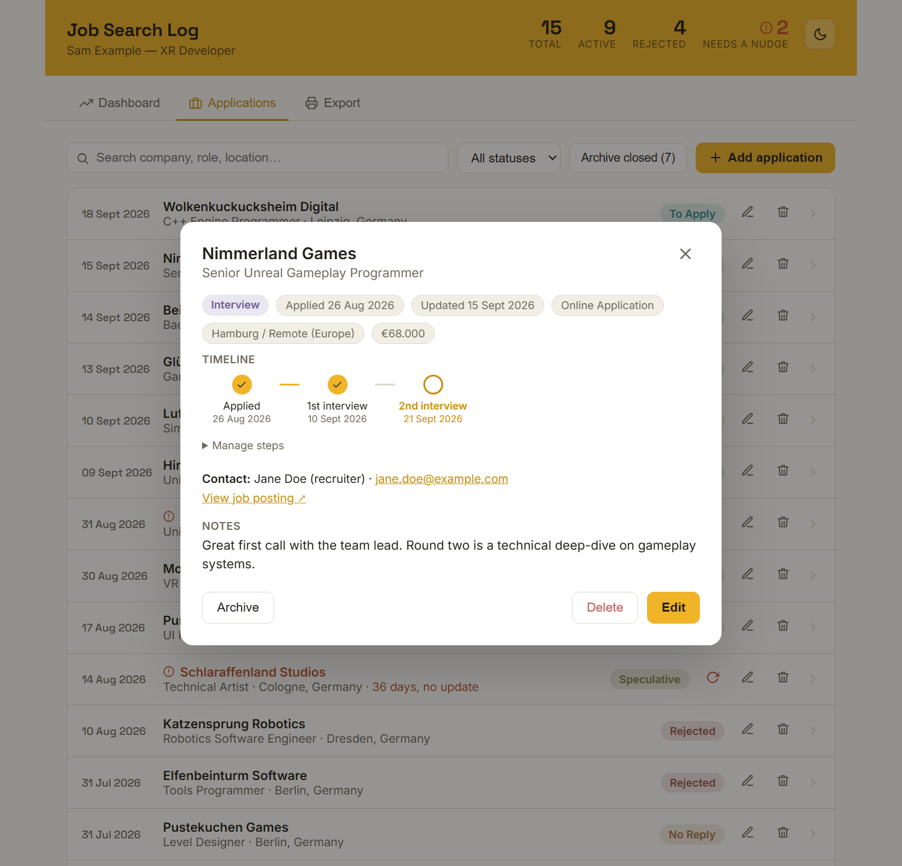
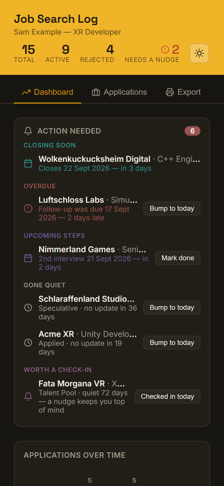
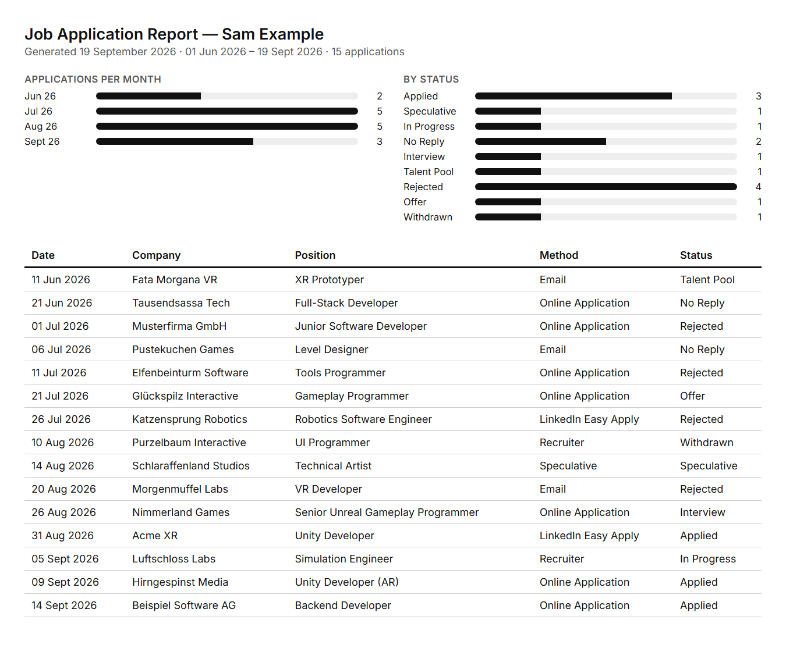
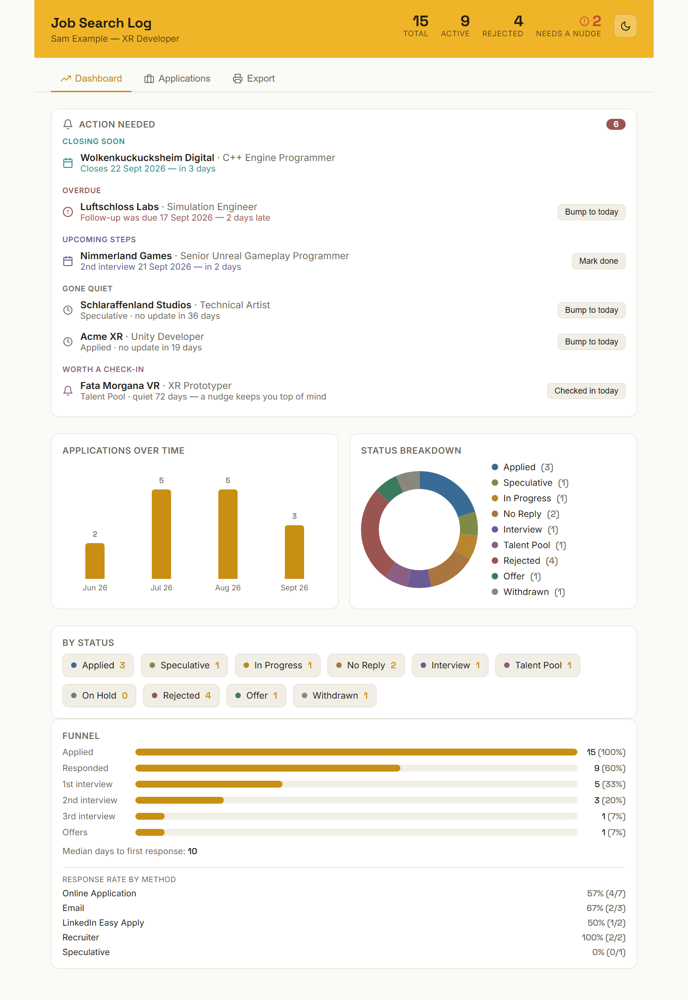

# Job Search Log

A job-application tracker that runs entirely in your browser. It's one HTML file: no install, no account, no backend.

## Use it

**[Open it in your browser](https://ajsgamedev.github.io/JobTracker/job_tracker.html)**, with nothing to install. It's the full app, not a demo: your entries are saved in your browser, just like the downloaded version.

Or download `job_tracker.html` and open it locally; it works fully offline. Either way, go to **Export → Your details** and add your name.

## Your data stays with you

Your applications are saved in your browser's local storage, on your own computer, and are never sent anywhere. The page makes no network requests at all, so it also works offline. That also means:

- **Back it up.** Use **Export → Export data (.json)** now and then; the app reminds you every 14 days. Clearing your browser data deletes your entries.
- **It doesn't sync.** A different browser or computer starts empty. Import your backup file there to carry your entries over.

## What it does

- Track each application from **To Apply** through **Applied** or **Speculative**, numbered interview rounds, and the outcome. **Talent Pool** and **On Hold** cover processes that are parked rather than dead.
- An **Action Needed** panel for closing deadlines, overdue follow-ups, upcoming interviews, and applications that have gone quiet. Speculative applications wait 30 days before nudging you, not 14.
- A **funnel** showing your response rate by application method and how far you get through interview rounds.
- **Archive** finished applications to keep your list short; they still count in your stats and report.
- **Add interviews to your calendar**: each upcoming step can be downloaded as a calendar event.
- **Pick your own app colour** under Export → Your details, or paste one in as `rgb(30, 58, 95)` or `#1E3A5F`.
- **Job application report:** a dated, printable list of your applications for any date range, with summary charts. Useful as proof of job-search activity. You can also download the same range as a spreadsheet (.csv) that opens in Excel.

## Screenshots

All companies and people shown are made up.

**An application's details**, with its interview timeline:

**On a phone** (dark mode) and **the printable report**:

  
  

**The whole dashboard**, including the funnel from application to offer:

## License

MIT, see [LICENSE](LICENSE).
